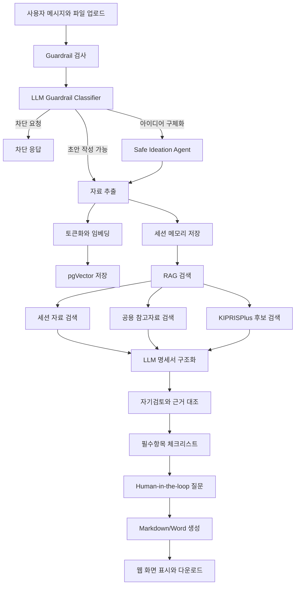

# SPEC Agent

SPEC Agent는 회의록, 아이디어 메모, 도면 설명, 상담 기록 같은 발명 자료를 바탕으로 한국 특허 출원명세서 검토용 초안을 작성하는 대화형 LLM Agent입니다.

자료를 그대로 양식에 채우는 도구가 아니라, 부족한 항목을 질문하고, 근거 없는 내용은 분리하며, KIPRISPlus 선행기술 후보와 체크리스트를 함께 보여주는 초안 작성 보조 도구입니다.

## 주요 기능

- PDF, DOCX, TXT, 이미지 자료 업로드
- 한 세션 안에서 대화와 자료 누적
- 출원명세서 필수항목 구조화
- 부족 항목과 검토 필요 항목 체크리스트 표시
- 자료가 부족할 때 안전한 아이디어 구체화 후보 제안
- KIPRISPlus 기반 국내 특허·실용 선행기술 후보 검색
- Markdown, Word 초안 다운로드

## 실행 방법

```powershell
git clone https://github.com/kkw047/spec-agent.git
cd spec-agent
```

백엔드 설치:

```powershell
cd backend
python -m venv .venv
.\.venv\Scripts\activate
pip install -r requirements.txt
```

프론트엔드 설치:

```powershell
cd ..\frontend
npm install
```

환경 파일 준비:

```powershell
cd ..
copy .env.example .env
```

`.env`에 OpenAI, PostgreSQL/pgVector, KIPRISPlus 값을 입력합니다.

## 실행

터미널 1:

```powershell
cd backend
.\.venv\Scripts\activate
uvicorn app.main:app --reload --host 127.0.0.1 --port 8000
```

터미널 2:

```powershell
cd frontend
npm run dev
```

접속 주소:

```text
http://localhost:5173
```

백엔드 상태 확인:

```text
http://localhost:8000/api/health
```

## 프로젝트 구조

```text
backend/
  app/
    main.py                 FastAPI API
    core/config.py          환경 설정
    models/schemas.py       요청/응답 모델
    services/spec_agent.py  LangGraph Agent 흐름
    services/guardrails.py  요청 차단과 의도 분류
    services/rag.py         pgVector 저장과 검색
    services/kipris.py      KIPRISPlus 후보 검색
    services/materials.py   업로드 파일 추출
    services/exporter.py    Word 출력

frontend/
  src/App.jsx               채팅 화면, 체크리스트, 다운로드 UI
  src/styles.css            화면 스타일

demo_materials/             발표와 테스트용 예시 자료
```

## 전체 흐름



## 데모 자료

`demo_materials/`에는 발표 전에 바로 테스트할 수 있는 예시 자료가 들어 있습니다.

| 폴더 | 주제 | 특징 |
|---|---|---|
| [`complete_baby_chair_case`](demo_materials/complete_baby_chair_case) | 접이식 유아용 의자 | 상담기록, 구성요소, 도면부호, 효과 자료 포함 |
| [`complete_flying_car_case`](demo_materials/complete_flying_car_case) | 도로주행/비행 겸용 자동차 | 비교적 완성된 초안 테스트용 |
| [`food_shape_case`](demo_materials/food_shape_case) | 새로운 식품 성형체 | 식품 구조와 제조 흐름 테스트용 |
| [`ergonomic_chair_case`](demo_materials/ergonomic_chair_case) | 인체공학 의자 | 센서/조절 구조 아이디어 테스트용 |
| [`ai_software_case`](demo_materials/ai_software_case) | AI 소프트웨어 발명 | 소프트웨어 특허 초안 테스트용 |
| [`complete_case`](demo_materials/complete_case) | 기본 완성 예시 | Markdown 자료 기반 테스트용 |

테스트 방법:

1. 웹 화면에서 `파일` 또는 `폴더` 버튼을 누릅니다.
2. 위 데모 폴더 중 하나의 파일들을 업로드합니다.
3. 아래처럼 메시지를 보냅니다.

```text
첨부 자료를 분석해서 출원명세서 검토용 초안을 작성해줘.
부족한 항목은 질문으로 알려주고, 근거 없는 수치나 도면부호는 만들지 마.
```
