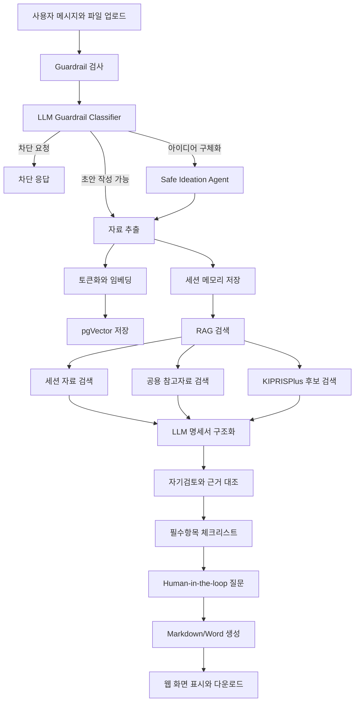

# SPEC Agent 흐름

이 문서는 SPEC Agent가 사용자 입력을 받아 출원명세서 검토용 초안과 체크리스트를 만드는 과정을 요약합니다.

발표용 상세 설명과 예상 질문은 [PRESENTATION_MATERIAL.md](PRESENTATION_MATERIAL.md)에 있습니다.

## 전체 흐름



## LangGraph 노드

```text
guardrail_node
receive_node
vectorize_node
memory_node
rag_node
kipris_node
structure_node
self_review_node
checklist_node
export_node
```

## 단계별 역할

| 단계 | 역할 |
|---|---|
| Guardrail | 허위 생성, 표절 위험, 최종 법률 판단 요청을 차단 |
| LLM Guardrail Classifier | 요청을 초안 작성, 안전한 구체화, KIPRIS 검색, 차단으로 분류 |
| Safe Ideation Agent | 자료가 부족할 때 확정 본문 대신 선택 후보와 질문 생성 |
| 자료 추출 | PDF, DOCX, TXT, 이미지 자료에서 텍스트와 메타데이터 추출 |
| 세션 메모리 | 한 세션 안에서 대화와 업로드 자료 누적 |
| 벡터 저장 | 자료 청크를 임베딩해 pgVector에 저장 |
| RAG | 세션 자료와 공용 참고자료에서 관련 문장 검색 |
| KIPRISPlus | 국내 특허·실용 공개/등록공보 후보 검색 |
| LLM 구조화 | 발명 명칭, 기술분야, 해결과제, 해결수단 등 명세서 항목 생성 |
| 자기검토 | 생성 결과를 원문, RAG, KIPRIS 근거와 대조 |
| 체크리스트 | 필수항목 완료/부족/검토 필요 판정 |
| 출력 | Markdown과 Word 초안 생성 |

## Human-in-the-loop 지점

- 자료가 부족할 때 추가 질문
- Agent가 제안한 후보 중 실제 발명 의도 선택
- 효과, 실험값, 도면부호, 안전성 자료 검토
- KIPRISPlus 후보와 실제 발명의 차이점 검토
- 최종 특허성 판단과 청구범위 확정

## 관련 문서

- [개발자 가이드](DEVELOPER_GUIDE.md)
- [API 연동 가이드](API_INTEGRATION_GUIDE.md)
- [수업 기술 매핑](LEARNED_TECH_MAPPING.md)
- [발표 자료와 예상 질문](PRESENTATION_MATERIAL.md)
