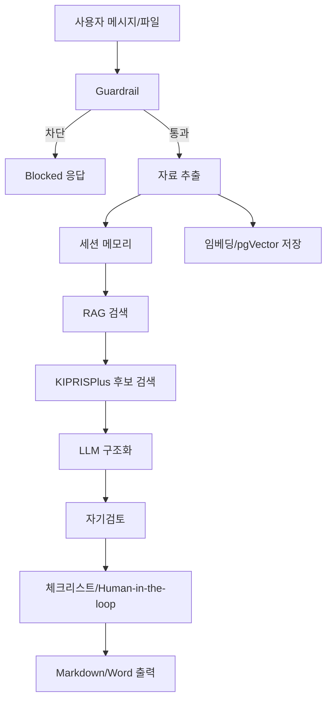

# SPEC Agent 처리 흐름

발표용 상세 흐름과 예상 질문은 `docs/PRESENTATION_MATERIAL.md`로 통합했습니다.

이 파일은 빠른 확인용 요약입니다.

## 핵심 흐름



## 실제 LangGraph 노드

```text
guardrail_node
receive_node
vectorize_node
memory_node
rag_node
kipris_node
structure_node
self_review_node
checklist_node
export_node
```

## 발표 때 볼 문서

- `docs/PRESENTATION_MATERIAL.md`: 발표용 통합 설명, 구조 방어, 예상 질문 답변
- `docs/LEARNED_TECH_MAPPING.md`: 수업 기술이 실제 구현 어디에 들어갔는지 매핑
- `docs/API_INTEGRATION_GUIDE.md`: OpenAI, PostgreSQL/pgVector, KIPRISPlus 설정 방법
