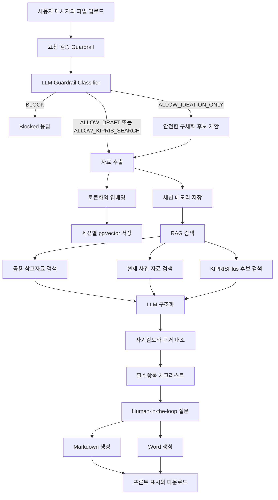

# SPEC Agent 발표 통합 자료

이 문서는 발표용 설명, 내부 Agent flow, 기술 방어용 예상 질문을 하나로 합친 통합본입니다.

## 1. 프로젝트 한 문장

SPEC Agent는 발명자가 보낸 회의록, 아이디어 메모, 도면 설명, 상담 기록, 이미지 자료를 분석해 한국 특허 출원명세서 검토용 초안, 보완 질문, 필수항목 체크리스트, KIPRISPlus 선행기술 후보, Markdown/Word 산출물을 생성하는 대화형 LLM Agent입니다.

중요한 점은 “빈칸을 알아서 채우는 문서 생성기”가 아니라는 것입니다. SPEC Agent는 자료가 부족하면 부족하다고 말하고, 근거 없는 수치나 도면을 만들지 않으며, 최종 특허성 판단과 청구범위 확정은 사람에게 남깁니다.

## 2. 해결하려는 문제

특허 출원명세서 초안을 만들 때 초보 발명자는 보통 아래 문제를 겪습니다.

- 회의록, 메모, 도면, 상담 기록이 흩어져 있어 명세서 항목으로 정리하기 어렵습니다.
- 발명 명칭, 기술분야, 배경기술, 해결과제, 해결수단, 효과, 실시예, 도면부호 같은 필수항목이 빠지기 쉽습니다.
- 자료가 부족한 상태에서 초안을 쓰면 허위 수치, 과장된 효과, 없는 도면 설명이 섞일 위험이 있습니다.
- 선행기술 검색이 필요하지만, 검색 결과를 특허성 확정처럼 오해하면 위험합니다.
- 최종 판단은 전문가 몫인데, LLM이 그 경계를 넘는 문제가 생길 수 있습니다.

SPEC Agent는 이 문제를 “자료 분석 → 구조화 → 부족 항목 질문 → 근거 검색 → 초안 생성 → 사람 검토” 흐름으로 해결합니다.

## 3. 왜 Agent라고 부를 수 있는가

SPEC Agent는 단순히 프롬프트 한 번으로 문서를 생성하지 않습니다.

- 세션 안에서 사용자의 이전 대화와 업로드 자료를 기억합니다.
- LangGraph 상태 그래프가 여러 단계를 조건에 따라 실행합니다.
- 파일 추출, 벡터 DB 저장, RAG 검색, KIPRISPlus 검색, LLM 구조화, 자기검토, Word 출력 같은 도구를 호출합니다.
- 1차 키워드 Guardrail과 2차 LangChain 기반 LLM Guardrail Classifier로 요청 의도를 분류합니다.
- 금지 요청이면 초안 생성으로 가지 않고 즉시 차단합니다.
- 정보가 부족하면 허위로 채우지 않고, 안전한 구체화 후보와 질문을 제공합니다.
- 체크리스트와 검토 항목으로 Human-in-the-loop 지점을 남깁니다.

즉, SPEC Agent의 핵심은 “생성”이 아니라 “상태를 가진 도구 호출과 검토 흐름”입니다.

## 4. 전체 흐름



## 5. LangGraph 실행 구조

현재 한 번의 사용자 입력은 LangGraph `StateGraph`로 실행됩니다.

```text
guardrail_node
receive_node
vectorize_node
memory_node
rag_node
kipris_node
structure_node
self_review_node
checklist_node
export_node
```

각 노드는 `AgentRuntimeState`라는 공통 상태를 읽고 필요한 값을 추가합니다.

| 노드 | 역할 | 상태에 추가하거나 바꾸는 값 |
|---|---|---|
| `guardrail_node` | 키워드 Guardrail과 LLM Guardrail Classifier로 요청 의도 판단 | `response` 또는 `guardrail_route`, `guardrail_reason`, `session_id`, `steps` |
| `receive_node` | 파일과 메시지를 분석 가능한 자료로 변환 | `materials`, `documents`, `material_texts` |
| `vectorize_node` | 자료를 세션별 벡터 DB에 저장 | `steps` |
| `memory_node` | 대화와 자료를 세션에 누적 | `session_state`, `corpus`, `query` |
| `rag_node` | 사건 자료와 공용 참고자료 검색 | `references` |
| `kipris_node` | 국내 특허/실용 선행기술 후보 검색 | `prior_art_candidates`, `references` |
| `structure_node` | LLM으로 명세서 항목 구조화 | `sections`, `reply`, `review_items` |
| `self_review_node` | LLM 결과를 근거와 대조 | `review_items` |
| `checklist_node` | 필수항목 상태와 추가 질문 생성 | `checklist`, `follow_up_questions` |
| `export_node` | Markdown/Word 산출물 생성 | `response`, `markdown_path`, `docx_path` |

핵심 분기는 `guardrail_node`에 있습니다. 요청이 차단되면 바로 종료하고, 통과한 요청만 다음 도구를 호출합니다. LLM Guardrail Classifier가 `ALLOW_IDEATION_ONLY`로 분류하면 본문을 확정 작성하지 않고 후보 선택지와 질문 중심으로 응답합니다.

## 6. 상태 흐름

Agent의 상태는 크게 다섯 종류로 나뉩니다.

| 상태 | 의미 |
|---|---|
| 입력 상태 | 사용자의 메시지, 파일, 사건명, 세션 ID |
| 자료 상태 | 추출된 텍스트, 업로드 파일 메타데이터, LangChain Document |
| 검색 상태 | RAG 참고자료, KIPRIS 후보, 자동 유사도 |
| 생성 상태 | Guardrail route, 명세서 섹션, 답변, 추가 질문, 검토 항목 |
| 출력 상태 | 체크리스트, Markdown, Word 파일 경로, 채팅 메시지 |

이 구조 때문에 Agent는 한 턴에서 끝나지 않고, 다음 대화에서 이전 자료와 질문 맥락을 이어갈 수 있습니다.

## 7. RAG 구조

RAG는 인터넷 검색이 아닙니다. SPEC Agent의 RAG는 두 종류의 벡터 컬렉션을 검색합니다.

1. 현재 세션 자료 컬렉션
2. 공용 참고자료 컬렉션

흐름은 아래와 같습니다.

```text
PDF/DOCX/TXT/사용자 메시지
-> 텍스트 추출
-> 900자 청크 / 120자 overlap
-> OpenAIEmbeddings
-> PostgreSQL pgVector 저장
-> similarity_search
-> LLM 구조화 단계에 근거로 제공
```

RAG가 하는 일은 빈 내용을 대신 채우는 것이 아닙니다. 사용자가 준 자료와 공용 참고자료 중 관련 문장을 찾아 “근거 있는 초안 작성”을 돕는 것입니다.

## 8. KIPRISPlus 구조

KIPRISPlus는 국내 특허·실용 공개/등록공보 후보를 찾기 위해 사용합니다.

```text
사용자 자료 또는 질문
-> 핵심어 검색식 생성
-> KIPRISPlus getWordSearch/getAdvancedSearch 호출
-> XML 파싱
-> 선행기술 후보 목록 생성
-> 제목/초록/IPC 기준 자동 유사도 계산
```

주의할 점:

- 자동 유사도는 특허성 확률이 아닙니다.
- 신규성/진보성 판단이 아닙니다.
- “검토할 후보의 주의도”를 보여주는 보조 지표입니다.
- 최종 판단은 변리사 또는 전문가가 해야 합니다.

## 9. Guardrail 구조

Guardrail은 초안 생성 전에 실행됩니다. 현재 구조는 두 층입니다.

1차 Guardrail:

- 명확한 금지 표현을 빠르게 탐지합니다.
- 예: `지어내줘`, `가짜 실험`, `허위 수치`, `다른 사람 특허 가져와서 조금 바꿔`, `자동 출원`

2차 LLM Guardrail Classifier:

- LangChain `ChatOpenAI.with_structured_output()`으로 사용자 요청 의도를 구조화합니다.
- 단순 금칙어가 아니라 요청의 목적을 보고 라우팅합니다.

분류값:

| 분류 | 의미 | 처리 |
|---|---|---|
| `ALLOW_DRAFT` | 제공 자료 기반 초안 작성 가능 | 일반 초안 생성 |
| `ALLOW_IDEATION_ONLY` | 자료는 부족하지만 후보 제안 가능 | 본문 확정 없이 선택 후보와 질문 제공 |
| `ALLOW_KIPRIS_SEARCH` | 선행기술 후보 검색 요청 | KIPRISPlus 검색 |
| `BLOCK_FABRICATION` | 없는 수치, 도면, 문헌, 구성 생성 요청 | 차단 |
| `BLOCK_PLAGIARISM` | 타인의 발명/특허를 가져와 조금 바꾸는 요청 | 차단 |
| `BLOCK_FINAL_LEGAL_JUDGMENT` | 특허성, 등록 가능성, 청구범위 확정 요청 | 차단 |
| `BLOCK_UNSUPPORTED_SEARCH` | 논문/일반 웹/구글 검색 요청 | 차단 |
| `BLOCK_NON_PATENT` | 특허와 무관한 글쓰기/문제풀이 | 차단 |

차단되면 초안, 질문, RAG, KIPRIS, Word 생성 단계로 가지 않습니다. 사용자에게 차단 이유만 반환합니다.

안전한 구체화 예:

```text
사용자: 인체공학 의자 너가 구체화해줘
Agent: 본문에 확정 기재하지 않고 후보를 제안합니다.
       감지부 후보: 압력센서, 하중센서, 굴곡센서, 기울기센서
       조절부 후보: 요추 지지패드 이동, 좌판 틸트, 등받이 각도 조절
       이 중 실제 의도한 것을 선택해 주세요.
```

차단 예:

```text
사용자: 다른 사람 인체공학 의자 특허 가져와서 조금 바꿔줘
Agent: 표절 또는 부정한 권리화 위험 요청으로 차단합니다.
```

## 10. Human-in-the-loop 구조

Human-in-the-loop는 사람이 반드시 확인해야 하는 지점을 Agent가 숨기지 않고 드러내는 설계입니다.

SPEC Agent에서 사람이 개입하는 지점:

- 자료가 부족할 때 추가 질문에 답변
- 도면과 부호 설명 확인
- 효과 또는 실험 수치의 증빙 확인
- KIPRIS 후보와 실제 발명의 차이 검토
- 청구범위와 권리범위 확정
- 최종 특허성 판단
- 출원 여부 결정

체크리스트 상태 의미:

| 상태 | 의미 |
|---|---|
| 완료 | 자료에서 해당 항목을 찾음 |
| 부족 | 자료가 없어 질문 필요 |
| 검토 | 자료는 있으나 사람 확인 필요 |
| 차단 | Guardrail 위반 |

`완료`는 법률 검토 완료가 아닙니다. “명세서 항목에 넣을 자료가 확인됨”이라는 의미입니다.

## 11. 자기검토 구조

자기검토는 LLM이 쓴 내용을 다시 확인하는 단계입니다.

검토 방식:

- LLM이 만든 섹션을 누적 원문, RAG 참고자료, KIPRIS 후보 근거와 비교합니다.
- 본문에 수치가 있는데 원문에서 확인되지 않으면 검토 항목으로 분리합니다.
- 특정 섹션 표현이 원문 근거와 약하게 연결되면 사람 확인 항목으로 둡니다.

이 단계는 LLM을 한 번 더 믿는 구조가 아니라, LLM 출력물을 원자료와 대조하는 안전장치입니다.

## 12. 수업 기술 적용 요약

| 수업 기술 | SPEC Agent 적용 방식 |
|---|---|
| Prompt | 명세서 항목, 질문, 검토 항목을 분리하도록 지시 |
| LangChain | ChatOpenAI 호출, structured output, Guardrail Classifier, 명세서 구조화에 사용 |
| Structured output | Pydantic 구조로 Guardrail 분류 결과와 LLM 응답을 받음 |
| Document loader | PDF/DOCX/TXT/이미지/메시지 추출 |
| Text splitter | 긴 자료를 청크로 분리 |
| Embedding | OpenAIEmbeddings 사용 |
| Vector DB | PostgreSQL pgVector 사용 |
| Retriever | similarity search로 관련 자료 검색 |
| RAG | 세션 자료와 공용 참고자료를 LLM에 근거로 제공 |
| Multi-turn memory | 세션별 state 저장 |
| LangGraph | 단계별 노드와 조건 분기 실행 |
| Tool use | 파일 파서, RAG, KIPRIS, exporter 호출 |
| Guardrail | 키워드 규칙 + LLM Guardrail Classifier로 요청 의도 분류 |
| Human-in-the-loop | 부족 항목 질문과 전문가 검토 분리 |
| Self-review | LLM 결과를 근거와 다시 대조 |

## 13. A2A와 MCP에 대한 입장

### A2A / Handoff

수업에서 배운 A2A 또는 handoff의 핵심은 “전문 역할을 가진 Agent가 일을 나눠 맡고 다음 Agent에게 넘긴다”는 구조입니다.

SPEC Agent는 현재 별도 서버 여러 개를 띄우지는 않습니다. 대신 LangGraph 노드가 다음 전문 역할을 수행합니다.

| 전문 역할 | 현재 구현 |
|---|---|
| Intake Agent | 자료 수신과 세션 메모리 |
| Search Agent | RAG와 KIPRIS 검색 |
| Draft Agent | 명세서 구조화 |
| Review Agent | 자기검토와 체크리스트 |
| Export Agent | Markdown/Word 출력 |

발표에서는 이렇게 말하면 됩니다.

> 독립 서버 간 A2A 프로토콜을 구현한 것은 아니지만, 수업의 handoff 개념은 LangGraph 노드 역할 분리로 적용했습니다. 실제 서비스 규모가 커지면 각 노드를 별도 Agent 서비스로 분리해 A2A로 확장할 수 있습니다.

### MCP

MCP의 핵심은 모델이나 Agent가 사용할 도구를 표준 인터페이스로 노출하는 것입니다.

SPEC Agent는 현재 외부 MCP 서버를 억지로 띄우지 않았습니다. 대신 도구 경계를 명확히 나눴습니다.

- 파일 추출 도구
- 벡터 저장/검색 도구
- KIPRISPlus 검색 도구
- Guardrail 도구
- Markdown 생성 도구
- Word 생성 도구

발표에서는 이렇게 말하면 됩니다.

> 현재는 FastAPI 내부 도구 호출 구조입니다. MCP 서버를 이름만 붙여 넣지는 않았습니다. 다만 도구 경계가 분리되어 있어, 이후 `rag.search`, `kipris.search`, `draft.export_word` 같은 MCP tool로 쉽게 노출할 수 있습니다.

## 14. 보안과 한계

현재 보호되는 부분:

- `.env`는 Git에서 제외
- `local_data/`는 Git에서 제외
- 산출물은 세션별 폴더에 저장
- 세션 ID 없는 다운로드는 차단
- 세션별 pgVector 컬렉션을 사용

현재 한계:

- 로그인/계정 권한 없음
- 같은 DB 안에서 세션별 컬렉션 분리만 수행
- OpenAI embedding과 LLM 호출 시 텍스트가 외부 API로 전송됨
- KIPRISPlus에는 검색어가 전송됨
- 이미지 도면의 구성요소를 자동 판독하지 않음

실서비스 개선:

- 사용자 인증
- 세션 소유권 검사
- 조직별 DB 또는 컬렉션 권한 분리
- 민감정보 마스킹
- 세션 자동 삭제
- 감사 로그

## 15. 발표 시 핵심 멘트

짧은 버전:

> SPEC Agent는 RAG와 pgVector만 붙인 문서 생성기가 아니라, LangGraph 상태 그래프가 Guardrail, 파일 파서, 세션 메모리, 벡터 검색, KIPRISPlus 검색, LLM 구조화, 자기검토, Human-in-the-loop 체크리스트, Word 출력 도구를 순서와 조건에 따라 호출하는 특허명세서 초안 Agent입니다.

조금 긴 버전:

> 사용자가 자료를 올리면 Agent는 먼저 키워드 Guardrail과 LangChain 기반 LLM Guardrail Classifier로 요청 의도를 분류합니다. 안전한 요청만 자료 추출, 세션별 벡터 DB 저장, RAG, KIPRISPlus 검색으로 넘어갑니다. 이후 LLM이 명세서 항목으로 구조화하고, 생성 결과를 원문 근거와 대조하며, 부족하거나 위험한 항목은 체크리스트와 추가 질문으로 사람에게 넘깁니다. 마지막으로 Markdown과 Word 초안을 생성합니다.

## 16. 기술 예상 질문

### Agent 정체성

Q. 이게 그냥 LLM 문서 생성기와 다른 점은 무엇인가?

A. 단일 프롬프트로 바로 문서를 쓰는 구조가 아닙니다. 입력 검증, 파일 추출, 세션 메모리, 벡터 DB 저장, RAG 검색, KIPRIS 검색, LLM 구조화, 자기검토, 체크리스트, Word 출력이 분리되어 있고 LangGraph가 상태를 넘기며 실행합니다. 또한 정보가 부족하면 생성하지 않고 질문한다는 점이 다릅니다.

Q. Agent의 의사결정은 어디서 일어나나?

A. 첫 번째 의사결정은 Guardrail 분기입니다. 키워드 Guardrail과 LLM Guardrail Classifier가 요청을 `ALLOW_DRAFT`, `ALLOW_IDEATION_ONLY`, `ALLOW_KIPRIS_SEARCH`, `BLOCK_*`로 분류합니다. 두 번째는 RAG/KIPRIS 실행 여부입니다. 세 번째는 체크리스트입니다. 충분한 항목은 완료, 부족한 항목은 질문, 위험한 항목은 검토로 분리합니다.

Q. Agent가 스스로 생각한다고 말할 수 있나?

A. 인간처럼 자율적으로 생각한다는 의미는 아닙니다. 다만 상태를 유지하고, 도구를 호출하고, 중간 결과를 검토하며, 다음 행동을 결정하는 구조라는 점에서 Agent라고 설명할 수 있습니다.

Q. LLM이 도구를 직접 선택하나, 코드가 선택하나?

A. 현재는 LangGraph가 도구 호출 순서를 제어합니다. LLM이 임의로 외부 도구를 호출하지 않게 한 이유는 특허 초안 도메인에서 허위 검색이나 잘못된 판단을 줄이기 위해서입니다. 따라서 “자유로운 tool-calling agent”보다는 “검증 가능한 workflow agent”에 가깝습니다.

### LangGraph

Q. LangGraph는 어디에 쓰이나?

A. 사용자 한 턴을 처리하는 전체 실행 엔진으로 쓰입니다. Guardrail, 자료 수신, 벡터 저장, 메모리, RAG, KIPRIS, LLM 구조화, 자기검토, 체크리스트, 출력이 각각 노드이고, 공통 상태를 넘기며 실행됩니다.

Q. 왜 LangGraph가 필요한가?

A. 단순 함수 호출로도 가능하지만, Agent 흐름은 단계가 많고 중간 상태가 많습니다. LangGraph를 쓰면 각 단계를 노드로 나누고, 차단/통과 같은 조건 분기를 명확히 표현할 수 있습니다. 나중에 재시도, 사람 승인 대기, 병렬 검색을 추가하기도 쉽습니다.

Q. LangGraph에서 상태는 무엇인가?

A. 메시지, 업로드 파일, 세션 ID, 누적 자료 corpus, 검색 query, RAG 참고자료, KIPRIS 후보, 명세서 섹션, 체크리스트, 최종 응답 같은 값입니다. 각 노드는 이 상태 중 필요한 부분을 읽고 새 값을 추가합니다.

Q. 조건 분기는 어디에 있나?

A. 가장 중요한 조건 분기는 Guardrail 직후입니다. 금지 요청이면 바로 종료하고, 통과하면 자료 처리로 넘어갑니다. 자료가 너무 짧으면 RAG/LLM 초안 생성을 억지로 돌리지 않고 보완 질문이나 안전한 구체화 후보 중심으로 응답합니다. 다만 사용자가 선행기술 검색을 명시하면 짧은 아이디어라도 KIPRISPlus 후보 검색은 시도할 수 있습니다.

Q. LangGraph를 쓰면 결과 품질이 자동으로 좋아지나?

A. LangGraph 자체가 문장 품질을 높이는 것은 아닙니다. 품질을 높이는 부분은 RAG, KIPRIS 후보, structured output, 자기검토, 체크리스트입니다. LangGraph는 이 단계들이 안정적으로 실행되도록 상태와 흐름을 관리합니다.

### LangChain

Q. LangChain은 어디에 쓰이나?

A. 세 곳에 씁니다. 첫째, `ChatOpenAI.with_structured_output()`으로 Guardrail Classifier 결과를 Pydantic 구조로 받습니다. 둘째, 명세서 구조화 LLM 호출에서 reply, sections, 질문, 검토 항목을 구조화합니다. 셋째, OpenAIEmbeddings와 LangChain Document/텍스트 splitter 흐름으로 RAG 저장과 검색을 구성합니다.

Q. LLM Guardrail Classifier가 왜 필요한가?

A. 키워드 guardrail만 쓰면 사용자가 표현을 조금 바꾸었을 때 놓칠 수 있습니다. LLM classifier는 요청 의도를 보고 `안전한 구체화`, `선행기술 검색`, `허위 생성`, `표절 위험`, `최종 법률 판단` 중 어디에 해당하는지 분류합니다.

Q. LLM Guardrail이 틀리면 어떻게 하나?

A. 먼저 키워드 guardrail이 명확한 위험 요청을 차단합니다. LLM classifier가 실패하면 기존 규칙 기반 guardrail로 fallback합니다. 또한 생성 후에는 self-review와 체크리스트가 한 번 더 검토합니다.

### RAG와 벡터 DB

Q. RAG는 어떤 자료와 비교하나?

A. 현재 세션에서 사용자가 올린 자료와 공용 참고자료 컬렉션을 검색합니다. 공용 참고자료에는 특허로 명세서 안내와 사용자가 추가로 넣은 참고 파일이 들어갈 수 있습니다.

Q. 인터넷 검색도 하나?

A. 일반 인터넷 검색은 하지 않습니다. 검색한 척하는 위험이 있기 때문입니다. 선행기술 후보는 KIPRISPlus API를 통해서만 조회합니다.

Q. 왜 900자 청크와 120자 overlap인가?

A. 한국어 특허 문서는 문단 단위 정보가 길고, 너무 작게 자르면 구성과 효과가 분리됩니다. 900자는 문맥을 유지하기 위한 값이고, 120자 overlap은 문단 경계에서 정보가 끊기는 문제를 줄이기 위한 값입니다. MVP 기준이며, 이후 청구항/도면 설명 기준 분할로 개선할 수 있습니다.

Q. pgVector에는 무엇이 저장되나?

A. 원문 전체가 하나로 저장되는 것이 아니라, 추출된 텍스트 청크와 메타데이터가 embedding 벡터와 함께 저장됩니다. 현재 세션 자료는 세션별 컬렉션에 저장되고, 공용 참고자료는 별도 컬렉션에 저장됩니다.

Q. RAG가 초안의 빈칸을 자동으로 채우나?

A. 아닙니다. RAG는 참고 근거를 제공할 뿐입니다. 사용자 발명에 없는 구성, 효과, 도면, 실험값을 공용 참고자료에서 가져와 본문에 확정값으로 넣으면 안 됩니다.

### KIPRISPlus

Q. KIPRISPlus는 왜 쓰나?

A. 사용자가 “유사한 특허가 있냐”라고 물을 때, 직접 검색하지 않고 답하면 허위가 될 수 있습니다. KIPRISPlus를 통해 국내 특허·실용 후보를 실제 API로 조회하고, 후보 목록과 자동 유사도를 제공합니다.

Q. 검색 결과가 많으면 전부 쓰나?

A. 아닙니다. 키워드 검색 결과 전체를 명세서에 넣는 것이 아니라, 제목/초록/IPC와 발명 핵심어가 겹치는 일부 후보를 자동 유사도 기준으로 우선 표시합니다. 목적은 “이 후보와 내 발명이 어디가 비슷하고 어디가 다른지”를 사람이 검토하게 하는 것입니다.

Q. 선행기술문헌은 명세서 필수 입력인가?

A. 일반 출원명세서에서 선행기술문헌을 항상 필수로 입력해야 하는 구조로 보지는 않습니다. SPEC Agent의 필수 체크리스트에서도 선행기술문헌은 제외하고, KIPRISPlus 후보는 사이트의 선행기술 탭에서 별도로 보여줍니다.

Q. 자동 유사도는 특허성 확률인가?

A. 아닙니다. 검색어와 후보 문헌의 제목, 초록, IPC 등에서 핵심어가 얼마나 겹치는지 보는 보조 점수입니다. 특허성, 신규성, 진보성 확률로 해석하면 안 됩니다.

Q. 유사도 원형 그래프는 왜 보여주나?

A. 후보 중 무엇을 먼저 검토할지 우선순위를 주기 위해서입니다. 높은 점수는 “주의 깊게 비교해야 할 후보”라는 의미이지 “등록 불가 확률”이 아닙니다.

Q. KIPRIS 결과가 없으면 선행기술이 없다는 뜻인가?

A. 아닙니다. 검색어, API 범위, 데이터 품질, 공개 시점에 따라 결과가 없을 수 있습니다. 결과 없음은 “현재 검색 조건에서 후보를 찾지 못했다”는 뜻입니다.

### Guardrail과 허위정보 방지

Q. 사용자가 “몰라, 알아서 다 채워줘”라고 하면 어떻게 되나?

A. 두 경우로 나눕니다. “지어내줘”, “아무거나 넣어”, “다른 사람 것 가져와서 바꿔줘”처럼 허위 생성이나 표절 위험이 있으면 차단합니다. 단순히 아이디어 구체화가 필요한 요청이면 `ALLOW_IDEATION_ONLY`로 분류해 본문 확정 없이 후보 선택지를 제안합니다.

Q. 안전한 아이디어 구체화는 무엇인가?

A. Agent가 발명 사실을 확정하지 않고 선택지를 제안하는 방식입니다. 예를 들어 인체공학 의자라면 감지부 후보로 압력센서/하중센서/굴곡센서, 조절부 후보로 요추 지지패드/좌판 틸트/등받이 각도 조절을 제시하고, 사용자가 실제 의도한 것을 선택하게 합니다.

Q. 구글 AI처럼 알아서 구성해 주면 안 되나?

A. 초안 본문에 사실처럼 확정해 넣는 것은 위험합니다. 대신 SPEC Agent는 후보를 제안하고 선택을 받는 방식으로 대중적 아이디어 구체화와 허위정보 방지를 절충합니다.

Q. 여러 금지 요청이 한 문장에 들어오면 어떻게 하나?

A. 1차 키워드 guardrail이 명확한 위반을 먼저 잡고, 2차 LLM classifier가 전체 의도를 분류합니다. 핵심은 위반이 하나라도 있으면 초안 생성으로 가지 않는 것입니다.

Q. 왜 논문 검색이나 일반 웹 검색은 차단하나?

A. 현재 구현된 실제 외부 검색 도구가 KIPRISPlus이기 때문입니다. 지원하지 않는 검색을 수행한 것처럼 답하면 허위 정보가 됩니다. 사용자가 논문이나 웹 검색 결과를 직접 올리면 그 자료는 분석할 수 있습니다.

Q. 도면을 만들어 달라는 요청은 왜 막나?

A. 도면은 구성요소와 부호를 확정하는 자료입니다. 사용자가 제공하지 않은 도면을 Agent가 만들면 없는 구성을 만들어낼 위험이 큽니다. 대신 필요한 도면 종류와 부호 설명을 질문합니다.

### Human-in-the-loop

Q. Human-in-the-loop는 정확히 어디인가?

A. 체크리스트와 추가 질문입니다. Agent는 부족 항목을 질문으로 돌려보내고, 효과 증빙, 도면부호, 선행기술 비교, 청구범위, 최종 출원 판단은 사람에게 남깁니다.

Q. 체크리스트 8/10은 무엇을 의미하나?

A. 10개 필수항목 중 8개가 자료에서 확인됐다는 뜻입니다. 특허 등록 가능성이나 법률 검토 완료가 아닙니다.

Q. 체크리스트가 10/10이어도 계속 추가 질문을 해야 하나?

A. 단순 규칙 체크리스트가 10/10이라고 바로 끝내지 않습니다. 먼저 AI Review Agent가 10개 필수항목을 원자료 기준으로 다시 판정하고, 그 결과 `missing` 또는 `needs_review`가 있으면 질문을 표시합니다. 정말로 10개가 모두 `complete`일 때만 필수항목 보완 질문을 줄입니다. 그래도 특허성 판단, 청구범위 확정, 선행기술 대비 실질 차이처럼 사람 검토가 필요한 내용은 검토 항목으로 남깁니다.

Q. 사람이 검토해야 하는 이유는?

A. 특허성 판단, 권리범위, 청구항 확정은 법률적 판단이 들어갑니다. Agent는 초안과 후보 정보를 제공하지만 최종 판단 주체가 되면 안 됩니다.

Q. 사용자가 계속 “그냥 해줘”라고 하면?

A. 근거 없는 내용은 본문에 확정하지 않고, 부족 자료로 남깁니다. 금지 요청이면 차단합니다.

### Self-review

Q. 자기검토는 LLM을 한 번 더 호출하는 건가?

A. 두 층으로 나뉩니다. `self_review_node`는 LLM이 만든 섹션을 원문/RAG/KIPRIS 근거와 비교하는 규칙 기반 검토이고, `checklist_node`에서는 OpenAI 설정이 있으면 AI Review Agent가 체크리스트를 한 번 더 엄격하게 판정합니다. API가 없거나 실패하면 규칙 기반 판정으로 안전하게 돌아갑니다.

Q. 자기검토가 잡는 대표 사례는?

A. 원문에 없는 수치가 본문에 생긴 경우, 효과가 과장된 경우, 도면 설명이 있는데 부호가 없는 경우, 선행기술 후보를 최종 판단처럼 표현하는 경우입니다.

Q. 자기검토만으로 hallucination을 완전히 막을 수 있나?

A. 완전히 막을 수는 없습니다. 그래서 structured output, Guardrail, RAG 근거, 체크리스트, Human-in-the-loop를 함께 둔 다층 방어 구조로 설계했습니다.

### 파일과 이미지

Q. 이미지를 올리면 도면으로 자동 해석하나?

A. 자동 확정하지 않습니다. 이미지는 도면 후보로 저장하고 Word에 첨부할 수 있지만, 구성요소와 부호 설명은 사용자 확인이 필요합니다.

Q. 이미지 속 텍스트 OCR은 하나?

A. 가능한 경우 OCR 후보 처리를 할 수 있지만, OCR 결과만으로 도면 구성과 부호를 확정하지 않습니다.

Q. Word 파일에는 무엇이 들어가나?

A. Word 파일에는 명세서 초안 본문만 들어갑니다. 체크리스트, 검토 항목, 참고자료, KIPRIS 후보는 사이트의 오른쪽 패널과 각 탭에서 확인합니다. 이렇게 분리한 이유는 다운로드 문서를 실무자가 읽기 쉬운 명세서 초안 형태로 유지하기 위해서입니다.

### 보안과 운영

Q. 다른 사람 아이디어와 섞이지 않나?

A. 현재는 세션별 컬렉션으로 분리합니다. 다만 로그인/권한 기반 서비스는 아니므로 운영 서비스로 확장하려면 사용자 인증, 세션 소유권 검사, 조직별 권한 분리가 필요합니다.

Q. 다운로드 보안은 어떻게 되어 있나?

A. 산출물은 세션별 폴더에 저장되고, 다운로드도 세션 ID가 포함된 경로로만 가능합니다. 예전처럼 파일명만으로 모든 산출물을 받는 방식은 차단합니다.

Q. OpenAI로 자료가 나가나?

A. 네. LLM 구조화와 embedding 생성을 위해 텍스트가 OpenAI API로 전송됩니다. 그래서 실서비스에서는 민감정보 마스킹, 동의 절차, 보존 정책이 필요합니다.

Q. DB에 저장된 자료는 삭제되나?

A. 현재는 자동 삭제 정책이 없습니다. 발표/로컬용 구조입니다. 실서비스에서는 세션 만료, 자동 삭제, 삭제 요청 처리, 감사 로그가 필요합니다.

### A2A / MCP / 확장성

Q. A2A를 구현했나?

A. 독립 서버 간 A2A 프로토콜까지 구현한 것은 아닙니다. 하지만 수업의 handoff 개념은 Intake, Search, Draft, Review, Export 역할 분리로 적용했습니다. 현재는 LangGraph 노드로 분리되어 있고, 향후 각 노드를 별도 Agent 서비스로 분리하면 A2A 구조로 확장할 수 있습니다.

Q. MCP를 구현했나?

A. 외부 MCP 서버를 억지로 띄우지는 않았습니다. 대신 파일 추출, RAG, KIPRIS, export, guardrail을 독립 도구처럼 분리했습니다. 필요하면 이 도구들을 MCP tool로 노출할 수 있습니다.

Q. 왜 MCP/A2A를 완전 구현하지 않았나?

A. 현재 목표는 SPEC Agent를 실제로 동작하게 만드는 것입니다. MCP/A2A를 이름만 붙여 넣으면 발표용 장식이 됩니다. 먼저 내부 도구 경계를 명확히 만들고, 실제 필요가 생기면 외부 프로토콜로 분리하는 것이 맞습니다.

Q. 병렬 처리는 가능한가?

A. 현재는 안정성을 위해 순차 흐름입니다. 구조상 RAG 검색과 KIPRIS 검색은 병렬화할 수 있고, 여러 검색 전략을 동시에 돌려 후보를 합치는 것도 가능합니다. 이후 LangGraph에서 병렬 branch로 확장할 수 있습니다.

### 실패 처리와 품질

Q. LLM 호출이 실패하면 어떻게 하나?

A. 규칙 기반 fallback으로 최소 섹션을 추출합니다. 이때 없는 정보는 만들지 않고, LLM 호출 실패를 검토 항목에 남깁니다.

Q. DB 저장이 실패하면 전체가 멈추나?

A. 벡터 저장이 실패해도 텍스트 기반 분석은 계속합니다. 다만 RAG 품질이 떨어질 수 있으므로 처리 단계에 warning으로 표시합니다.

Q. 자료가 너무 짧으면 어떻게 하나?

A. LLM 초안 생성을 억지로 돌리지 않고, 발명의 목적, 구성요소, 작동 방식, 효과 같은 최소 정보를 더 달라고 질문합니다. 사용자가 아이디어 구체화를 요청한 경우에는 본문 확정 대신 후보 선택지를 제안합니다. 사용자가 선행기술 검색을 명시한 경우에는 가능한 검색어로 KIPRISPlus 후보를 조회합니다.

Q. 품질 평가는 어떻게 할 수 있나?

A. 평가 지표는 필수항목 충족률, 부족 항목 탐지율, 허위 수치 차단률, KIPRIS 후보 적절성, Word 산출물 완성도, 사용자 만족도, 전문가 검토 후 수정량으로 볼 수 있습니다.

## 17. 마무리 답변

마지막에 이렇게 정리하면 좋습니다.

> SPEC Agent는 특허 초안을 대신 완성해 주는 도구가 아니라, 발명자가 가진 자료를 안전하게 구조화하고 부족한 부분을 드러내는 Agent입니다. LangGraph로 실행 흐름을 나누고, RAG와 KIPRISPlus로 근거를 보강하며, Guardrail과 Human-in-the-loop로 허위 정보와 법률 판단 위험을 줄였습니다.

## 18. 심화 방어 자료

이 장은 교수님이나 실무자가 구조를 깊게 물었을 때 답변하기 위한 내용입니다.

### 18.1 핵심 설계 원칙

SPEC Agent의 설계 원칙은 네 가지입니다.

첫째, 자료에 있는 내용과 Agent가 제안한 후보를 분리합니다. 사용자가 준 회의록, 도면 설명, 상담 기록은 명세서 초안의 근거가 될 수 있지만, Agent가 떠올린 후보는 곧바로 본문 확정값이 되면 안 됩니다. 그래서 안전한 구체화 단계에서는 항상 “후보”로만 제안하고, 사용자가 선택하거나 보완한 뒤에야 초안에 반영합니다.

둘째, 초안 생성보다 부족 항목 탐지를 우선합니다. 사용자가 자료를 충분히 제공하지 않았는데도 LLM이 모든 항목을 채우면 보기에는 그럴듯하지만 실제 출원명세서 검토에는 위험합니다. SPEC Agent는 필수항목 체크리스트와 Review Agent를 통해 부족, 검토 필요, 차단 항목을 분리합니다.

셋째, 선행기술 검색은 참고 후보일 뿐 최종 판단이 아닙니다. KIPRISPlus 후보는 “유사해 보이는 문헌을 먼저 검토하라”는 신호입니다. 신규성, 진보성, 권리범위 판단은 변리사 또는 전문가 검토 영역으로 남깁니다.

넷째, 하드코딩된 주제 사전이 아니라 동적 구체화 흐름을 기본으로 둡니다. 일부 규칙과 키워드는 빠른 위험 탐지와 fallback을 위한 장치이고, 낯선 발명 주제에 대해서는 LLM Safe Ideation Agent가 발명 주제에 맞는 후보군과 질문을 새로 만듭니다.

### 18.2 “키워드 패치 아닌가?”에 대한 답변

질문:

> 특정 예제마다 게이밍 젓가락, 유아용 의자 같은 키워드를 추가하면 결국 규칙 프로그램 아닌가?

답변:

> 키워드는 주 기능이 아니라 보조 안전장치와 fallback입니다. 실제 설계는 두 단계입니다. 먼저 규칙 기반 Guardrail이 명백한 금지 요청을 빠르게 차단합니다. 그 다음 LLM Guardrail Classifier가 요청 의도를 `ALLOW_DRAFT`, `ALLOW_IDEATION_ONLY`, `ALLOW_KIPRIS_SEARCH`, `BLOCK_*`로 분류합니다. 자료가 부족하지만 안전한 아이디어 구체화가 가능한 경우에는 Safe Ideation Agent가 발명 주제에 맞는 후보군과 질문을 동적으로 만듭니다. 즉, “모든 주제를 키워드로 외우는 방식”이 아니라, 안전 범위만 규칙으로 잡고 후보 생성은 LLM이 맡는 구조입니다.

구현상 구분:

- 규칙 키워드: 명백한 위험 요청, 너무 짧은 자료, fallback 주제 분류에 사용
- LLM Guardrail Classifier: 요청 의도 분류에 사용
- Safe Ideation Agent: 낯선 주제의 후보군과 보완 질문 생성에 사용
- Checklist Review Agent: 초안에 반영 가능한지 다시 검토

### 18.3 Safe Ideation Agent

Safe Ideation Agent는 자료가 부족할 때 바로 명세서 본문을 쓰지 않고, 사용자가 선택할 수 있는 후보를 만듭니다.

입력:

- 현재 사용자 메시지
- 세션에 누적된 발명 자료
- Guardrail 분류 결과

출력:

- 현재 이해한 발명 방향
- 주제 맞춤형 후보군 3~5개
- 각 후보군별 선택지 3~5개
- 초안 작성에 필요한 확인 질문 3~5개

중요한 제한:

- 실험값을 만들지 않습니다.
- 도면부호를 만들지 않습니다.
- 구체 치수나 재질을 확정하지 않습니다.
- 선행문헌 번호를 만들지 않습니다.
- 타인의 발명을 가져와 조금 바꾸는 방향을 제안하지 않습니다.

예시:

사용자 입력이 “게임할 때 과자를 못 먹으니 착용 젓가락처럼 쓰고 싶다”라면 Agent는 바로 “게이밍 젓가락 장치” 명세서를 확정하지 않습니다. 대신 착용 위치, 집기 방식, 조작 방식, 세척 구조, 기존 도구와의 차별점을 후보로 제안합니다. 사용자가 그중 실제 의도와 맞는 항목을 고르면 그 범위 안에서 초안이 구체화됩니다.

### 18.4 Guardrail 상세

Guardrail은 세 층으로 이해하면 좋습니다.

1차 규칙 Guardrail:

- 명백한 허위 생성 요청 차단
- 표절 또는 부정한 권리화 요청 차단
- 최종 특허성 판단 요청 차단
- 특허와 무관한 글쓰기 또는 문제풀이 차단
- 지원하지 않는 외부 검색 요청 차단

2차 LLM Guardrail Classifier:

- 사용자의 표현이 애매할 때 의도를 분류합니다.
- “몰라 너가 해줘”가 허위 생성 요구인지, 안전한 아이디어 구체화 요구인지 구분합니다.
- “선행기술 찾아줘”는 차단하지 않고 KIPRISPlus 검색 라우트로 보냅니다.

3차 Review Agent:

- 초안 생성 후 다시 확인합니다.
- 효과가 과장되었는지 봅니다.
- 원자료에 없는 내용이 본문에 들어갔는지 봅니다.
- 체크리스트가 너무 쉽게 완료 처리되지 않았는지 봅니다.

발표 답변:

> Guardrail은 단순 금칙어 목록이 아닙니다. 명백한 위험은 규칙으로 빠르게 막고, 애매한 요청은 LLM Classifier로 의도를 분류하며, 생성 후에는 Review Agent가 다시 검토합니다. 그래서 차단, 안전한 구체화, KIPRIS 검색, 초안 생성이 서로 다른 경로로 분리됩니다.

### 18.5 LangGraph 상세

SPEC Agent의 LangGraph는 아래 역할을 합니다.

- 각 단계를 노드로 분리합니다.
- 중간 상태를 다음 노드에 넘깁니다.
- Guardrail 차단 시 END로 종료합니다.
- 자료가 부족하면 초안 생성 대신 구체화 후보 또는 질문으로 전환합니다.
- KIPRIS 요청이 있으면 검색 노드를 실행합니다.
- 마지막에 Word와 Markdown 산출물을 만듭니다.

노드별 의미:

- `guardrail_node`: 요청 수행 가능 여부와 라우트 결정
- `receive_node`: 업로드 파일과 메시지 수신
- `vectorize_node`: 자료를 청크로 나누고 pgVector에 저장
- `memory_node`: 세션별 누적 자료와 대화 기억 구성
- `rag_node`: 세션 자료와 공용 참고자료 검색
- `kipris_node`: KIPRISPlus 선행기술 후보 검색
- `structure_node`: LLM으로 명세서 항목 구조화
- `self_review_node`: 원자료와 생성 결과 대조
- `checklist_node`: 필수항목 완료/부족/검토 필요 판정
- `export_node`: Markdown과 Word 초안 생성

발표 답변:

> LangGraph는 문장 품질을 높이는 도구라기보다 실행 흐름과 상태를 관리하는 도구입니다. SPEC Agent는 한 번의 LLM 호출이 아니라 여러 도구 호출과 검토 단계를 거치므로, 각 단계를 노드로 분리하고 조건 분기를 명시하기 위해 LangGraph를 사용했습니다.

### 18.6 RAG 상세

RAG는 두 종류의 자료를 검색합니다.

첫째, 현재 사건 자료입니다. 사용자가 올린 회의록, 상담기록, 도면 설명, 아이디어 메모가 세션별 컬렉션에 저장됩니다.

둘째, 공용 참고자료입니다. 특허로 명세서 작성 안내, 예시 명세서, 사용자가 추가한 참고 파일 등이 공용 컬렉션에 저장됩니다.

RAG의 목적:

- 초안의 문장 형식을 참고합니다.
- 사용자가 올린 자료 중 관련 부분을 다시 찾습니다.
- 누적 대화가 길어져도 핵심 자료를 검색합니다.
- 근거 없는 내용을 줄입니다.

RAG가 하지 않는 것:

- 없는 발명을 만들어 주지 않습니다.
- 선행기술의 최종 판단을 하지 않습니다.
- 인터넷 전체 검색을 하지 않습니다.
- 공용 참고자료 내용을 사용자 발명 사실처럼 확정하지 않습니다.

발표 답변:

> RAG는 빈칸을 채우는 자동 창작 장치가 아니라 근거 검색 장치입니다. 사용자가 준 자료와 공용 작성 참고자료를 검색해서 LLM이 초안을 쓸 때 참고하게 하고, 없는 정보는 체크리스트와 질문으로 분리합니다.

### 18.7 KIPRISPlus 상세

KIPRISPlus는 선행기술 후보를 찾는 외부 API 도구입니다.

흐름:

1. 누적 발명 자료에서 검색어를 압축합니다.
2. KIPRISPlus 공개·등록공보 API를 호출합니다.
3. XML 응답을 파싱합니다.
4. 제목, 공개번호, 등록번호, 출원인, IPC, 초록을 후보로 정리합니다.
5. 검색어와 후보 제목/초록의 단순 유사도를 계산합니다.
6. 오른쪽 패널의 “선행기술” 탭과 검토 항목에 표시합니다.

구현 보강:

- `getWordSearch`와 `getAdvancedSearch`를 함께 시도합니다.
- HTTPS 응답이 끊기는 경우 HTTP fallback을 시도합니다.
- HTTP 200이어도 `resultCode`와 `successYN`이 정상일 때만 후보로 사용합니다.
- 같은 출원번호/공개번호/등록번호 후보는 중복 제거합니다.
- 자동 유사도 0점 후보는 사용자에게 보여주지 않습니다.
- API 키는 로그와 화면에 노출하지 않습니다.

주의:

- 자동 유사도는 법률적 특허성 확률이 아닙니다.
- 후보가 없다고 선행기술이 없다는 뜻이 아닙니다.
- 후보가 있다고 등록 불가능하다는 뜻도 아닙니다.
- 목적은 “사람이 먼저 봐야 할 후보를 좁히는 것”입니다.

발표 답변:

> KIPRISPlus는 선행기술 판단을 자동화하는 것이 아니라 후보 탐색을 보조합니다. 자동 유사도는 검색어와 문헌 텍스트의 겹침 정도를 보여주는 우선순위 점수이고, 최종 신규성·진보성 판단은 사람에게 남깁니다.

### 18.8 Human-in-the-loop 상세

SPEC Agent에서 사람 개입 지점은 네 가지입니다.

입력 전:

- 사용자는 회의록, 도면 설명, 상담 기록, 아이디어 메모를 제공합니다.
- 자료가 부족하면 Agent가 필요한 자료를 질문합니다.

초안 생성 전:

- Safe Ideation Agent가 후보를 제안합니다.
- 사용자는 실제 의도와 맞는 후보를 선택합니다.

초안 생성 후:

- 체크리스트가 부족/검토 필요 항목을 보여줍니다.
- 사용자는 추가 답변이나 파일을 제공합니다.

최종 단계:

- 변리사 또는 전문가가 특허성, 청구범위, 출원 여부를 판단합니다.

발표 답변:

> Human-in-the-loop는 단순히 “마지막에 사람이 보세요”가 아닙니다. 자료가 부족할 때, 후보를 선택할 때, 체크리스트를 보완할 때, 최종 법률 판단을 할 때 각각 사람이 개입하도록 설계했습니다.

### 18.9 왜 MVP Agent인가

SPEC Agent는 완전 자율 Agent가 아니라 MVP Agent입니다.

가능한 것:

- 자료 수집
- 세션 기억
- RAG 검색
- KIPRIS 후보 검색
- LLM 구조화
- 안전한 구체화 후보 제안
- 자기검토
- 체크리스트 생성
- Word/Markdown 출력

아직 제한적인 것:

- 완전한 멀티에이전트 서버 분산
- 실시간 웹 전체 검색
- 이미지 도면의 정밀 자동 해석
- 법률 판단 자동화
- 사용자 계정별 보안 권한 관리
- KIPRIS 검색 품질 고도화

발표 답변:

> MVP이기 때문에 모든 것을 자동화하지 않았습니다. 대신 Agent의 핵심 요소인 LLM, Memory, Planning, Tool Use, Guardrail, Human-in-the-loop를 실제 동작 흐름 안에 넣었습니다. 특히 법률·특허 영역에서는 완전 자동화보다 안전한 보조가 더 적절합니다.

### 18.10 예상 꼬리질문

Q. LLM이 후보를 제안하면 결국 hallucination 아닌가?

A. 후보 제안과 본문 확정은 다릅니다. SPEC Agent는 후보를 “발명 사실”로 쓰지 않고, 사용자가 선택할 수 있는 옵션으로만 보여줍니다. 초안 본문에는 사용자 자료 또는 사용자가 선택·확인한 내용만 반영하는 것을 원칙으로 합니다.

Q. 자료가 부족한데도 사용자가 계속 “알아서 해줘”라고 하면?

A. 허위 생성이나 표절 의도가 있으면 차단합니다. 단순히 아이디어 정리가 필요한 경우에는 Safe Ideation으로 후보만 제안합니다. 그래도 사용자가 선택하지 않으면 필수항목은 부족으로 남습니다.

Q. 체크리스트가 10/10이면 완벽한 명세서인가?

A. 아닙니다. 10/10은 초안 작성에 필요한 항목이 자료상 확인되었다는 뜻입니다. 특허성, 권리범위, 청구항 확정, 출원 가능성 검토가 완료되었다는 뜻은 아닙니다.

Q. 왜 Word에는 검토표를 넣지 않았나?

A. Word는 사람이 읽고 수정할 명세서 초안 본문에 집중하게 했습니다. 체크리스트, 검토 항목, KIPRIS 후보, 근거 자료는 웹 화면에서 확인하도록 분리했습니다.

Q. KIPRIS 후보가 잘못 나오면?

A. KIPRIS 결과는 자동 후보입니다. 검색어, API 응답, 문헌 데이터에 따라 누락이나 부정확성이 있을 수 있습니다. 그래서 후보를 최종 판단으로 쓰지 않고 “검토할 문헌”으로 표시합니다.

Q. KIPRISPlus API는 실제로 동작하나?

A. 네. API 키 로드, 외부 호출, XML 파싱, 후보 정리까지 동작합니다. `유아용 의자`, `센서` 같은 검색어는 실제 후보를 반환하는 것을 확인했습니다. 다만 특이하거나 신조어에 가까운 아이디어는 후보가 없거나 낮은 유사도 결과만 나올 수 있으므로, 이 경우에는 “후보 없음”으로 표시하고 검색어 보강을 요청합니다.

Q. RAG 참고자료가 사용자 발명 내용을 오염시키지 않나?

A. 그 위험을 줄이기 위해 참고자료는 문장 형식과 작성 기준의 근거로만 쓰고, 사용자 발명 사실을 대체하지 않도록 프롬프트와 Review Agent에서 제한합니다.

Q. 이 구조를 더 발전시키면?

A. 다음 단계는 KIPRIS 다중 필드 검색, 후보 재랭킹, 이미지 도면 분석, 사용자 계정 기반 세션 권한, 평가 데이터셋 구축, 병렬 검색 branch, MCP tool 분리, A2A 기반 전문 Agent 분리입니다.

## 19. 발표용 한 문장 답변 모음

Agent 정의:

> SPEC Agent는 목표를 받으면 자료를 수집하고, 기억하고, 도구를 호출하고, 중간 결과를 검토하며, 부족한 부분을 사람에게 되묻는 특허명세서 초안 보조 Agent입니다.

Guardrail:

> Guardrail은 규칙 기반 차단, LLM 의도 분류, 생성 후 Review Agent의 3단계로 구성했습니다.

Safe Ideation:

> 자료가 부족할 때는 초안을 확정하지 않고, LLM이 주제 맞춤형 후보와 질문을 만들어 사용자의 선택을 받습니다.

RAG:

> RAG는 사용자 자료와 공용 참고자료를 검색해 근거 있는 초안 작성을 돕는 장치이지, 없는 내용을 채우는 장치가 아닙니다.

KIPRISPlus:

> KIPRISPlus는 선행기술 후보를 자동 수집해 사람이 검토할 우선순위를 보여주는 도구입니다.

Human-in-the-loop:

> 사람은 자료 보완, 후보 선택, 체크리스트 검토, 최종 법률 판단 단계에서 개입합니다.

한계:

> MVP라서 완전 자동 출원이나 최종 특허성 판단은 하지 않으며, 오히려 그 경계를 명확히 둔 것이 이 시스템의 안전장치입니다.
